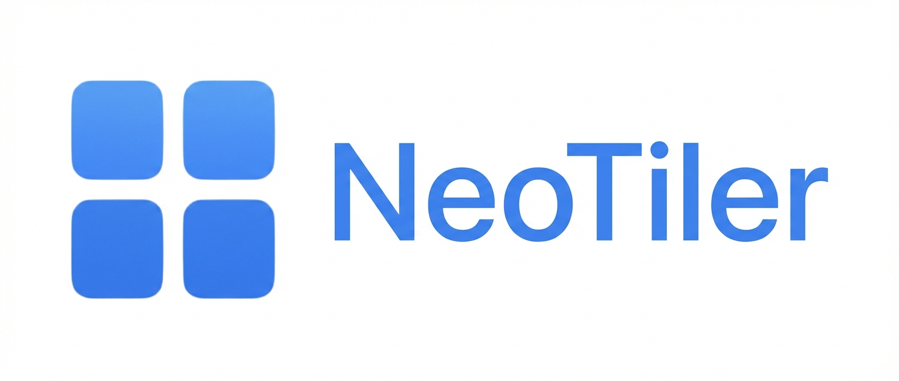

  

  <strong>Lightweight, native macOS window manager with smart workspaces, custom snap areas, trackpad gestures, and more.</strong>

  
  
  
  
  

  

---

## 🎬 See It in Action

  <video src="assets/demo-snap-workspace.mp4" alt="NeoTiler Window Snapping & Smart Workspaces Demo" width="720" autoplay loop muted playsinline></video>

<em>Snap windows instantly, create custom layouts, and switch between workspaces with a single shortcut.</em>

---

## 🤔 Why NeoTiler?

macOS window management is **broken by default**. The built-in tiling only supports basic halves and quarters — no custom areas, no workspaces, no gestures.

NeoTiler fixes this. **One app. One purchase. Total control.**

| Pain Point | macOS Built-in | NeoTiler |
|:---|:---:|:---:|
| Custom snap areas | ❌ | ✅ |
| Smart Workspaces | ❌ | ✅ |
| Trackpad gestures | ❌ | ✅ |
| Thirds / sixths layouts | ❌ | ✅ |
| Multi-monitor cursor sync | ❌ | ✅ |
| App Switcher replacement | ❌ | ✅ |
| Windows-style taskbar | ❌ | ✅ |
| Shake to focus | ❌ | ✅ |
| Auto-snap rules | ❌ | ✅ |
| Zero data collection | ⚠️ | ✅ |

---

## ✨ Features

### ⌨️ Keyboard-First Window Snapping

Snap any window to halves, quarters, thirds, or custom positions with fully customizable keyboard shortcuts.

| Layout | Default Shortcut |
|--------|:---:|
| Left Half | `⌘ + ⌥ + ←` |
| Right Half | `⌘ + ⌥ + →` |
| Top Half | `⌘ + ⌥ + ↑` |
| Bottom Half | `⌘ + ⌥ + ↓` |
| Quarters | `⌘ + ⌥ + U/I/J/K` |
| Thirds | `⌃ + ⌥ + ←/↓/→` |
| Maximize | `⌘ + ⌥ + M` |
| Center | `⌘ + ⌥ + C` |

> Every shortcut is fully remappable in Preferences.

### 🖱️ Drag-to-Edge Snap

Drag a window to any screen edge or corner — a visual overlay shows where it will snap. Release to confirm. Just like Windows, but better.

  <video src="assets/demo-hero.mp4" alt="Drag-to-Edge Snap Demo" width="480" autoplay loop muted playsinline></video>

### 🎯 Custom Snap Areas (Magnetic Grid)

Create **your own** snap zones — define any region on your screen as a snap target. Go beyond rigid halves and quarters.

  <video src="assets/demo-custom-snap.mp4" alt="Custom Snap Areas Demo" width="480" autoplay loop muted playsinline></video>

### 📱 Smart Workspaces

Save and restore complete window layouts. Switch between "Coding Mode", "Design Mode", and "Meeting Mode" with a single shortcut.

- Save the current layout of all open windows
- Recall any saved workspace instantly
- Workspaces remember app positions across restarts
- Quick switch via `⌘ + ⌥ + 1/2/3`

### 🖐️ Trackpad & Mouse Gestures

Control windows with natural gestures — swipe, pinch, or use custom mouse button combinations.

  <video src="assets/demo-gestures.mp4" alt="Trackpad Gestures Demo" width="480" autoplay loop muted playsinline></video>

### 🫨 Shake to Focus

Shake a window with your mouse to instantly minimize all other windows and focus on what matters.

  <video src="assets/demo-shake.mp4" alt="Shake to Focus Demo" width="480" autoplay loop muted playsinline></video>

### ⚡ Advanced App Switcher

A beautiful, powerful replacement for `⌘ + Tab` with window previews, search, and quick actions.

  <video src="assets/demo-app-switcher.mp4" alt="Advanced App Switcher Demo" width="480" autoplay loop muted playsinline></video>

### 🖥️ Multi-Monitor Support

- Independent snap zones per display
- Move windows between monitors with `⌘ + ⌥ + [ / ]`
- **Cursor Sync** — your cursor teleports between screens seamlessly
- Relative positioning preserved when moving windows

### 📌 Auto-Snap Rules

Define where specific apps should always open. Safari always on the left? Terminal always bottom-right? Set it once, forget it forever.

### 🪟 Windows-Style Taskbar

A familiar taskbar at the bottom of your screen for quick window switching, previews, and management.

### 🌗 Native Dark Mode

Built with SwiftUI — automatically follows your system appearance. Looks gorgeous in both light and dark modes.

---

## 🔒 Privacy & Security

NeoTiler is built with a **privacy-first** philosophy:

- **Zero data collection** — no analytics, no telemetry, no tracking
- **100% local processing** — everything runs on your Mac
- **No internet required** — works fully offline after activation
- **No subscription** — buy once, own forever
- **Notarized by Apple** — verified safe by Apple's security checks

> NeoTiler only requires Accessibility permission to read and move window positions. No other permissions needed.

---

## 💰 Pricing

| | Free Trial | Lifetime License |
|:---|:---:|:---:|
| Duration | 14 days | Forever |
| All features | ✅ | ✅ |
| Updates | ✅ | ✅ |
| Price | Free | **$9.99** (one-time) |

No subscriptions. No hidden fees. No upsells.

  

---

## 📦 System Requirements

| Requirement | Minimum |
|:---|:---|
| **macOS** | 13.0 Ventura or later (up to macOS 26 Tahoe) |
| **Architecture** | Intel (x86_64) or Apple Silicon (M1–M5) |
| **Disk Space** | ~25 MB |
| **Permissions** | Accessibility (required) |

---

## 📋 Installation

1. **Download** NeoTiler from [getneotiler.com](https://getneotiler.com) or the [Releases](https://github.com/user/neotiler-mac-window-manager/releases) page
2. **Open** the `.dmg` file and drag NeoTiler to Applications
3. **Launch** NeoTiler — it will appear in your menu bar
4. **Grant** Accessibility permission when prompted
5. **Start snapping** windows with keyboard shortcuts or drag-to-edge!

---

## 🆚 How NeoTiler Compares

### vs Rectangle

Rectangle Free is limited to basic snapping. Rectangle Pro costs $9.99 but still lacks gestures, a taskbar, and shake-to-focus. NeoTiler includes **everything** for the same price.

👉 [Full Comparison: NeoTiler vs Rectangle](https://getneotiler.com/rectangle-alternative)

### vs Magnet

Magnet ($9.99) offers basic snapping but no custom snap areas, no workspaces, no gestures, and no taskbar. NeoTiler does all of that and more.

👉 [Full Comparison: NeoTiler vs Magnet](https://getneotiler.com/magnet-alternative)

### vs Moom

Moom ($14.99) is powerful but dated. No trackpad gestures, no taskbar, no modern SwiftUI interface. NeoTiler is faster, more modern, and cheaper.

👉 [Full Comparison: NeoTiler vs Moom](https://getneotiler.com/moom-alternative)

### vs BetterSnapTool

BetterSnapTool ($2.99) has custom snap areas but lacks workspaces, gestures, app switcher, and a taskbar. NeoTiler is the complete package.

👉 [Full Comparison: NeoTiler vs BetterSnapTool](https://getneotiler.com/bettersnaptool-alternative)

### vs macOS Built-in Tiling

macOS Sequoia introduced basic tiling, but it only supports halves and quarters. No custom areas, no workspaces, no gestures, no keyboard customization.

👉 [Full Comparison: NeoTiler vs macOS Built-in Tiling](https://getneotiler.com/macos-tiling-alternative)

---

## ❓ FAQ

<strong>Is NeoTiler a one-time purchase or subscription?</strong>

 
One-time purchase of $9.99. No subscriptions, no recurring fees. You own it forever.

<strong>Does NeoTiler work on Apple Silicon (M1/M2/M3/M4/M5)?</strong>

 
Yes! NeoTiler is a Universal Binary that runs natively on both Intel and Apple Silicon Macs.

<strong>Does NeoTiler collect any data?</strong>

 
No. Zero data collection. No analytics, no telemetry, no tracking. Everything runs 100% locally on your Mac.

<strong>Does it work with Stage Manager?</strong>

 
Yes. NeoTiler includes Stage Manager compatibility mode to minimize conflicts.

<strong>Can I use it with multiple monitors?</strong>

 
Absolutely. NeoTiler supports unlimited monitors with independent snap zones, cursor sync, and cross-monitor window moving.

<strong>Is there a free trial?</strong>

 
Yes! 14-day free trial with all features unlocked. No credit card required.

<strong>What macOS versions are supported?</strong>

 
macOS 13 Ventura through macOS 26 Tahoe (and future versions).

<strong>How do I get support?</strong>

 
Open an <a href="https://github.com/user/neotiler-mac-window-manager/issues">Issue</a> here on GitHub or email <a href="mailto:support@getneotiler.com">support@getneotiler.com</a>.

---

## 🌍 Available Languages

NeoTiler is fully localized in **11 languages**:

🇬🇧 English · 🇹🇷 Türkçe · 🇯🇵 日本語 · 🇩🇪 Deutsch · 🇪🇸 Español · 🇫🇷 Français · 🇮🇹 Italiano · 🇩🇰 Dansk · 🇳🇱 Nederlands · 🇵🇱 Polski · 🇨🇳 简体中文

---

## 🐛 Bug Reports & Feature Requests

Found a bug? Have a feature idea? We'd love to hear from you!

- **🐛 Bug Reports:** [Open an Issue](https://github.com/user/neotiler-mac-window-manager/issues/new?template=bug_report.md)
- **💡 Feature Requests:** [Open an Issue](https://github.com/user/neotiler-mac-window-manager/issues/new?template=feature_request.md)
- **💬 General Discussion:** [Open an Issue](https://github.com/user/neotiler-mac-window-manager/issues/new)

---

## 📰 Changelog

See [CHANGELOG.md](CHANGELOG.md) for a detailed list of changes in each version.

---

## 👨‍💻 About

NeoTiler is created by **[Veysel Okatan](https://www.linkedin.com/in/veysel-okatan/)** at **[C-Software Studio](https://www.linkedin.com/company/c-software-studio/)**.

Built by an independent developer who switched from Windows to macOS and was frustrated by the lack of proper window management. NeoTiler is the tool he wished existed.

---

## 📄 License

NeoTiler is proprietary software. This repository contains documentation, release notes, and community resources only — no source code.

Copyright © 2024-2026 NeoTiler by C-Software Studio. All rights reserved.

---

  

  Made with ❤️ for macOS power users everywhere.

